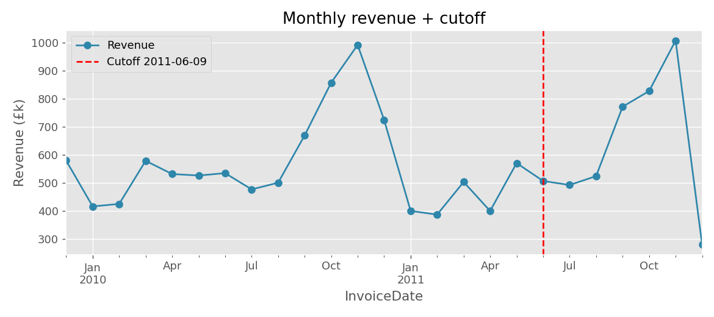
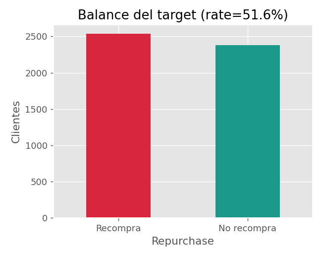
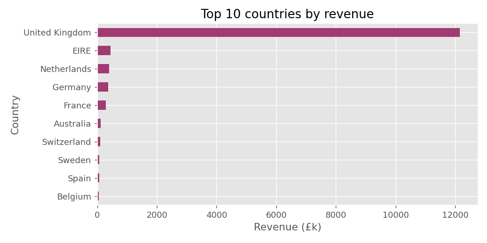
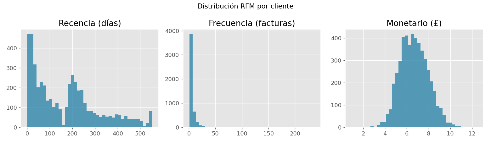
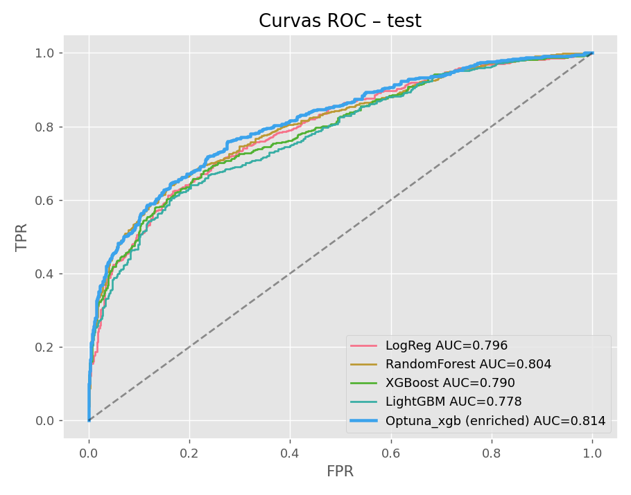
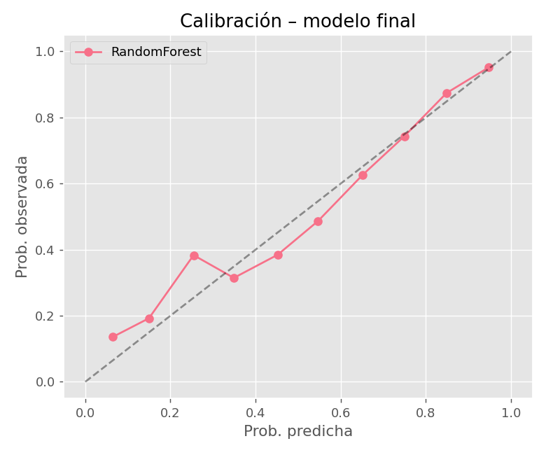
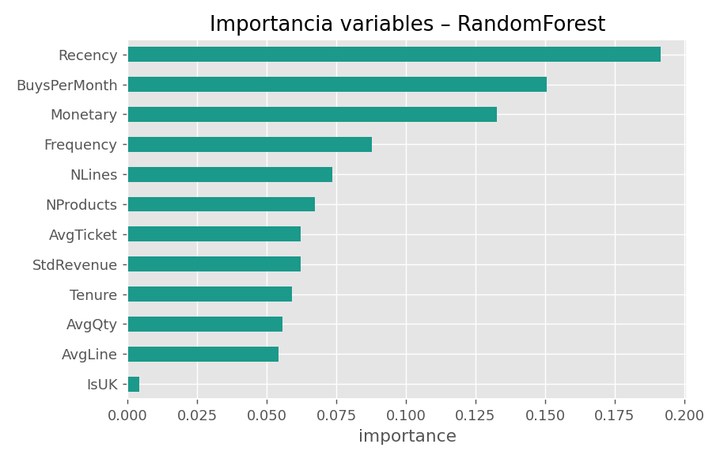
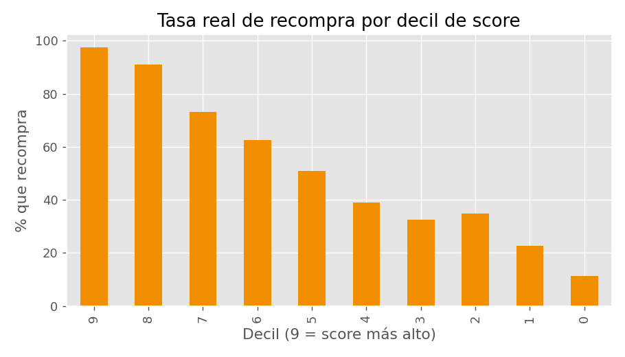

<!-- _class: cover -->

# Predicción de recompra de clientes

## Online Retail II — Modelo de probabilidad de recompra a 6 meses

Daniel Ribes · Máster en Machine Learning — Trabajo final

31 de mayo de 2026 · github.com/danribes/ml-trabajo-final-online-retail

---

# 1 · Contexto de negocio y objetivo

**El encargo.** Como data scientist de un retailer online (UK, artículos de regalo, muchos clientes mayoristas), identificar entre la base de clientes a quienes tienen **alta probabilidad de volver a comprar**, para accionar campañas diferenciadas.

### Objetivo del modelo
Estimar, para cada cliente, **P(recompra en los próximos 6 meses)** a partir de su historial transaccional.

### Por qué importa
- **Fidelización** → clientes con alta probabilidad.
- **Retención / win-back** → clientes con baja probabilidad.

### Hipótesis de partida
- El comportamiento **RFM** (recencia, frecuencia, gasto) discrimina la recompra.
- La **intensidad de compra** (ritmo, dispersión del gasto) añade señal sobre el RFM clásico.

---

# 2 · El dataset

**Online Retail II** (UCI ML Repository) — todas las transacciones de un retailer online UK sin tienda física, **01-12-2009 → 09-12-2011** (24 meses, 2 hojas Excel).

1.07 M

líneas de transacción

8

columnas

24

meses de histórico

~5.8 K

clientes con ID

| Columna | Tipo | Descripción |
|---|---|---|
| `Invoice` | Nominal | Nº factura (6 díg.). Prefijo **`C`** = cancelación |
| `StockCode` | Nominal | Código de producto |
| `Description` | Nominal | Nombre del producto |
| `Quantity` | Numérico | Unidades por línea |
| `InvoiceDate` | Fecha | Fecha y hora de la factura |
| `Price` | Numérico | Precio unitario (£) |
| `CustomerID` | Nominal | Identificador de cliente |
| `Country` | Nominal | País de residencia |

---

# 3 · Vista previa de los datos

Carga de las 2 hojas concatenadas → **1.067.371 filas × 8 columnas**. `df.head()`:

| Invoice | StockCode | Description | Quantity | InvoiceDate | Price | CustomerID | Country |
|---|---|---|---:|---|---:|---:|---|
| 489434 | 85048 | 15CM CHRISTMAS GLASS BALL 20 LIGHTS | 12 | 2009-12-01 07:45 | 6.95 | 13085 | United Kingdom |
| 489434 | 79323P | PINK CHERRY LIGHTS | 12 | 2009-12-01 07:45 | 6.75 | 13085 | United Kingdom |
| 489434 | 79323W | WHITE CHERRY LIGHTS | 12 | 2009-12-01 07:45 | 6.75 | 13085 | United Kingdom |
| 489434 | 22041 | RECORD FRAME 7" SINGLE SIZE | 48 | 2009-12-01 07:45 | 2.10 | 13085 | United Kingdom |
| 489434 | 21232 | STRAWBERRY CERAMIC TRINKET BOX | 24 | 2009-12-01 07:45 | 1.25 | 13085 | United Kingdom |

Grano = <strong>línea de factura</strong> (un producto). El modelo trabaja a nivel <strong>cliente</strong>, así que habrá que agregar por <code>CustomerID</code>.

---

# 4 · Calidad de los datos

### Diagnóstico (`df.info` + nulos)
- **CustomerID nulo: 22,8 %** → no etiquetables.
- Description nulo: 0,4 % → impacto mínimo.
- **34.335 duplicados** exactos.
- Rango fechas confirmado: 2009-12 → 2011-12.

### Anomalías detectadas
- Cancelaciones (`Invoice` empieza por **`C`**).
- Códigos de servicio: `POST`, `DOT`, `M`, `AMAZONFEE`… (no son producto).
- `Quantity ≤ 0` y `Price ≤ 0` (devoluciones / errores de captura).
- Outliers de revenue por línea (cola larga).

→ Estas observaciones definen las reglas de limpieza de la slide 7.

---

<!-- _class: divider -->

# Metodología

## Cómo se traduce el problema de negocio en un problema de ML

---

# 5 · Enfoque metodológico y justificación

| Decisión | Elección | Por qué |
|---|---|---|
| **Tipo de problema** | Clasificación binaria supervisada (recompra sí/no) | Negocio quiere **rankear** clientes por probabilidad, no predecir un importe |
| **Unidad de análisis** | El cliente (no la transacción) | La acción comercial se dirige a personas → agregamos por `CustomerID` |
| **Diseño temporal** | Fecha de corte + ventana de label de 180 días | Evita *data leakage*; simula la predicción real: "hoy predigo los próximos 6 meses" |
| **Features** | RFM clásico + intensidad de compra | Estándar en CRM/retail, **interpretable** para negocio y con buena señal |
| **Algoritmos** | Baseline lineal + 3 modelos de árbol | Relaciones no lineales y colas largas → árboles; sin "volvernos locos" (brief) |
| **Métrica primaria** | **AUC** (+ AP y Brier) | Target balanceado (~52 %) y problema de *ranking*; Brier controla la calibración |
| **Validación** | Holdout 75/25 estratificado + CV en el tuning | Estimación honesta del rendimiento fuera de muestra |

---

# 6 · Pipeline de extremo a extremo

1. **Carga** + control de calidad de datos
2. **Limpieza** y filtrado defendible
3. **Fecha de corte** + variable objetivo
4. **Feature engineering** (RFM + extras)
5. **Análisis exploratorio** (EDA)

6. **Modelado** — LogReg, RF, XGBoost, LightGBM
7. **Optimización** — RandomizedSearchCV
8. **Diagnóstico** — ROC, calibración, lift
9. **Importancia** de variables
10. **Uso de negocio** — segmentación por decil

Todo el pipeline es <strong>reproducible</strong>: <code>build_pipeline.py</code> regenera artefactos, métricas y figuras; el notebook se ejecuta de principio a fin sin intervención manual.

---

# 7 · Limpieza y exclusiones

**Criterio: cada exclusión debe ser defendible ante negocio.** De 1,07 M de líneas → **798.641 líneas limpias / 5.823 clientes**.

| Filtro | Filas eliminadas | Justificación |
|---|---|---|
| `CustomerID` nulo | ~243 K | Sin ID no se puede modelar la recompra del cliente |
| Cancelaciones (`C*`) | ~20 K | Eventos negativos, no compras |
| Códigos de servicio | ~2 K | `POST`, `DOT`, `AMAZONFEE`… no son producto |
| `Quantity ≤ 0` ó `Price ≤ 0` | varios | Devoluciones / errores de captura |
| Outliers top 0,5 % revenue/línea | ~5 K | Estabilidad de los modelos lineales (cap £305) |

---

# 8 · Definición de la variable objetivo

### Esquema temporal
- **Entreno** con transacciones `< 2011-06-09`.
- **Etiqueto** con compras en `[2011-06-09, 2011-12-06]` (180 días).
- `Repurchase = 1` si el cliente vuelve a comprar **al menos una vez** en esa ventana.

El corte cae **6 meses antes** del final del dataset → deja una ventana completa para observar la recompra.

4.914

clientes en periodo pre-corte (modelables)

51,6 %

tasa de recompra (positivos)

Target prácticamente balanceado → <strong>sin necesidad de re-muestreo</strong>; AUC es métrica primaria válida.

---

# 9 · Feature engineering — RFM + intensidad

Agregación por cliente sobre el periodo pre-corte. **12 variables** en 3 familias:

### RFM clásico
- `Recency` — días desde la última compra
- `Frequency` — nº de facturas
- `Monetary` — gasto total

### Volumen
- `NLines`, `NProducts`, `Tenure`

### Intensidad / patrón
- `BuysPerMonth` — ritmo de compra
- `AvgTicket`, `AvgLine`, `AvgQty`
- `StdRevenue` — dispersión del gasto
- `IsUK` — mercado doméstico

| CustomerID | Recency | Frequency | Monetary | AvgTicket | AvgQty | StdRevenue | IsUK |
|---:|---:|---:|---:|---:|---:|---:|---:|
| 12347 | 62 | 4 | 3.146,75 | 786,69 | 12,5 | 21,15 | 0 |
| 12348 | 64 | 4 | 1.388,40 | 347,10 | 56,5 | 28,35 | 0 |
| 12349 | 223 | 2 | 2.221,14 | 1.110,57 | 9,9 | 17,34 | 0 |

---

<!-- _class: divider -->

# Análisis exploratorio

## Las gráficas que orientaron el modelado

---

# 10 · EDA — Ingresos mensuales y fecha de corte

**Lectura.** Tendencia creciente con pico estacional en **Q4** (campaña navideña). La línea de corte (2011-06-09) cae **a mitad de la curva** → la ventana de label captura comportamiento representativo, no solo el pico.

---

# 11 · EDA — Balance del target y concentración geográfica

~52 % recompran → clases equilibradas.

~85 % del revenue es UK.

**Implicaciones.** (1) Sin desbalance fuerte → AUC fiable y sin re-muestreo. (2) `IsUK` aporta poca señal discriminante (casi todo es UK) — se confirma luego en la importancia de variables.

---

# 12 · EDA — Distribución de las variables RFM

**Lectura.** `Recency`, `Frequency` y `Monetary` presentan **colas largas / asimetría** marcada → los modelos **basados en árboles** (insensibles a la escala y capaces de captar no linealidades) deberían rendir mejor que un lineal puro.

---

<!-- _class: divider -->

# Modelado y resultados

---

# 13 · Comparación de algoritmos

**Estrategia:** un *baseline* lineal interpretable + tres modelos de árbol. Split holdout **75/25 estratificado** (3.685 train / 1.229 test). Métricas en test:

| Modelo | AUC | AP | Brier |
|---|---:|---:|---:|
| Logistic Regression *(baseline)* | 0,796 | 0,820 | 0,184 |
| **Random Forest** | **0,803** | **0,833** | **0,180** |
| XGBoost | 0,789 | 0,823 | 0,194 |
| LightGBM | 0,778 | 0,812 | 0,229 |

- Los árboles **no** superan claramente al lineal → señal mayormente monótona, capturada ya por el RFM.
- **Random Forest** lidera en las tres métricas (mejor AUC **y** mejor Brier).

---

# 14 · Optimización — RandomizedSearchCV

Búsqueda aleatoria (`n_iter=12`, CV=3, scoring=`roc_auc`) sobre **LightGBM**, el candidato con más margen de tuning:

### Espacio de búsqueda
`n_estimators`, `num_leaves`, `learning_rate`, `subsample`, `colsample_bytree`, `min_child_samples`, `reg_alpha`, `reg_lambda`.

### Mejores hiperparámetros
`learning_rate=0.02`, `num_leaves=63`, `n_estimators=300`, `subsample=0.85`, `reg_alpha=1.0`, `reg_lambda=1.0`.

### Resultado
LightGBM **0,778 → 0,791** AUC tras el tuning.

Mejora real, pero <strong>aún por debajo</strong> del Random Forest sin tunear (0,803). El tuning confirma que el techo del problema con estas features ronda AUC ≈ 0,80.

---

# 15 · Elección del modelo final

### Criterio
Máximo **AUC** en test, con calibración (**Brier**) como desempate.

### Ganador → **Random Forest**
- AUC **0,803** · AP **0,833** · Brier **0,180**.
- Mejor en discriminación **y** en calibración.
- Robusto, pocas hiperparametrizaciones críticas, no requiere escalado.

### Por qué no los boosters
- XGBoost / LightGBM no aportan ventaja con 12 features y ~5 K clientes.
- Mayor riesgo de sobreajuste y más coste de tuning para igual o peor resultado.

Navaja de Occam: el modelo más simple que rinde igual o mejor gana.

---

# 16 · Diagnóstico — ROC y calibración

**Lectura.** Curva ROC claramente sobre la diagonal (AUC 0,80). La curva de calibración sigue la diagonal ideal → las **probabilidades son fiables** y usables directamente para segmentar, sin recalibración obligatoria.

---

# 17 · Importancia de variables

### Top drivers
1. **Recency** (0,19) — cuánto hace de la última compra
2. **BuysPerMonth** (0,15) — ritmo
3. **Monetary** (0,13) — gasto
4. **Frequency** (0,09)

`IsUK` ≈ 0 → confirma lo visto en EDA.

El RFM clásico + ritmo de compra explica la mayor parte de la señal → modelo coherente con la intuición de negocio.

---

# 18 · Vista de negocio — lift por decil de score

97 %

recompra en el decil TOP (vs 51,6 % base)

12 %

recompra en el decil más bajo

El score ordena la base de forma <strong>monótona y accionable</strong>: un gradiente claro de probabilidad por decil.

---

# 19 · Conclusiones y propuesta de uso

**El modelo (Random Forest, AUC 0,80) separa con fiabilidad** a quién retener de a quién fidelizar. Plan accionable por decil de score:

| Segmento (decil) | Probabilidad | Acción comercial |
|---|---|---|
| **9–10** | Alta | **Fidelización**: programa VIP, acceso prioritario a colecciones, NPS |
| **5–8** | Media | **Cross-sell**: cupones personalizados, recomendación por afinidad |
| **0–4** | Baja | **Retención / win-back**: descuento agresivo + encuesta de churn |

Drivers de la decisión: <strong>Recency</strong>, <strong>ritmo de compra</strong>, <strong>gasto</strong> y <strong>frecuencia</strong> — interpretables y comunicables a negocio.

---

# 20 · Próximos pasos

1. **Validación temporal *rolling*** — repetir con cortes alternativos para medir robustez.
2. **Nuevas features** — categoría de producto, estacionalidad (pico Q4), recurrencia por SKU.
3. **Optimizar el umbral** con curva coste/beneficio (coste de campaña vs CLV recuperado).
4. **Re-entreno trimestral** + monitorización de *drift* en las variables RFM.
5. **Restricciones monótonas** sobre Recency/Frequency en un gradient boosting.
6. **Calibración fina** (Platt / isotónica) si se pasa a una segmentación binaria dura.

---

<!-- _class: divider -->

# Gracias

## ¿Preguntas?

github.com/danribes/ml-trabajo-final-online-retail
